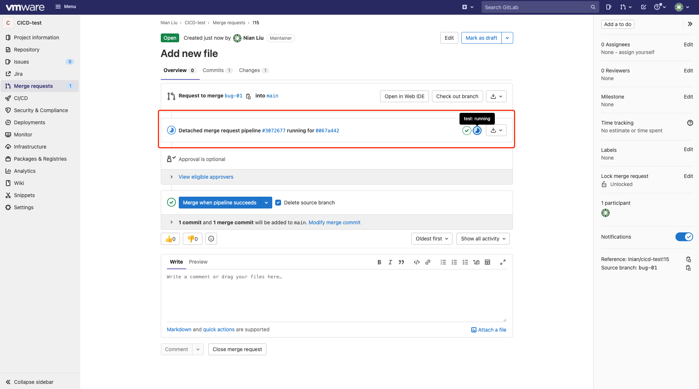
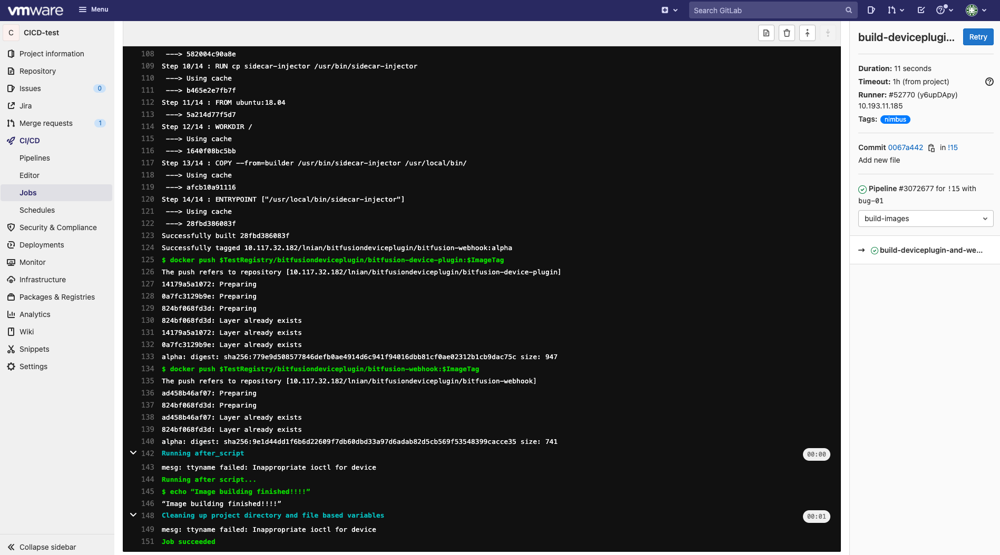
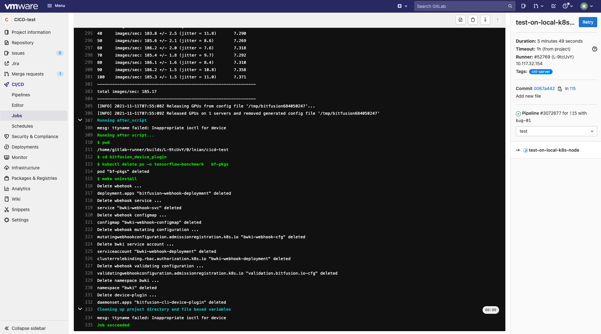
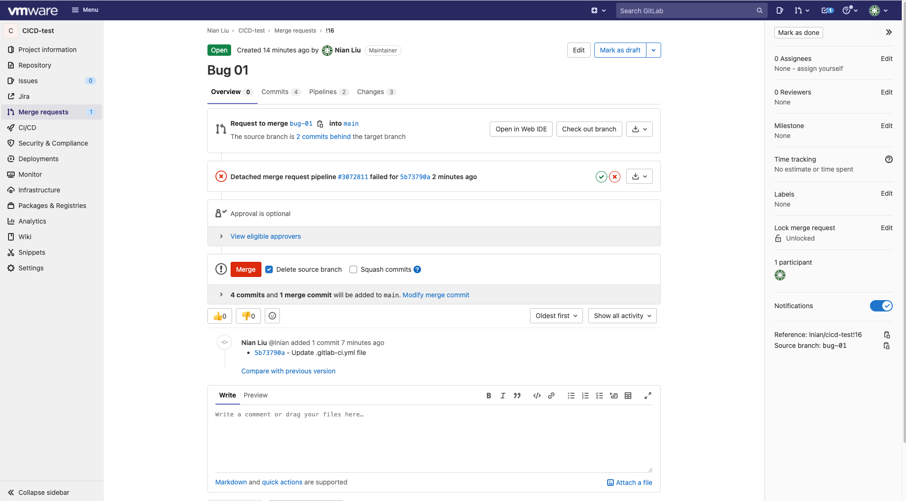
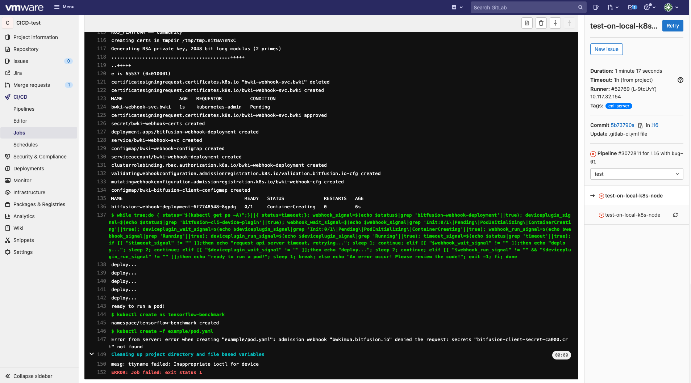
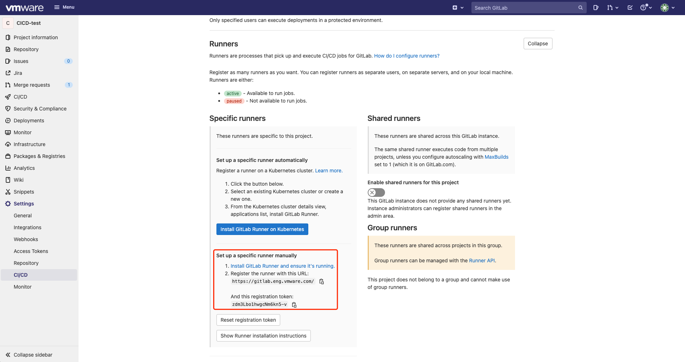
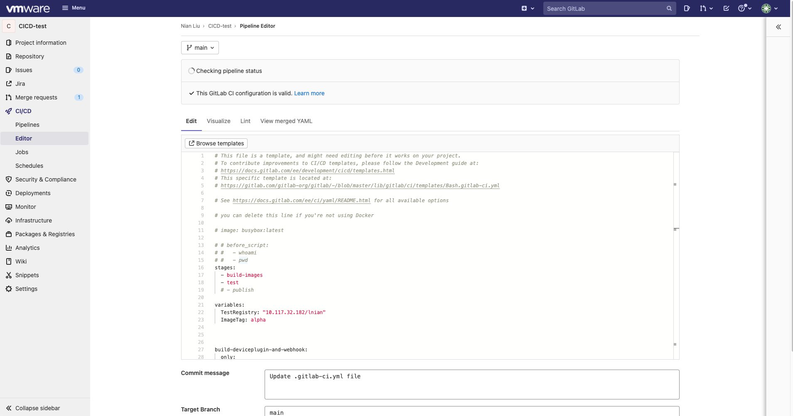
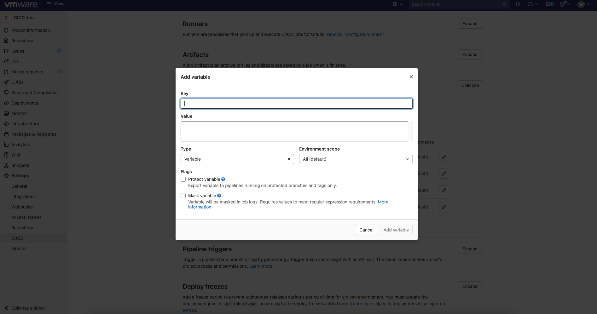

# CI/CD for Phaedo
CI-CD for Phaedo是Phaedo项目的子工具，当项目的main分支收到任何，merge request的请求时，GitLab会根据`.gitlab-ci.yml`文件中设计的流水线(pipline)任务，自动测试和验证请求中改动的代码的有效性，主要负责的功能有：
* 代码中是否存在语法级错误，利用Dockerfile文件能否成功编译编译并生成所需要的webhook和device plugin的镜像。
* 将新构建的镜像部署到用于测试的kubernetes节点上，同时创建使用GPU资源的pod来检验webhook和device plugin能否提供有效服务。

## 1. 快速入门
### 1.1. .gitlab-ci.yml文件
使用CI-CD for Phaedo，当有merge request提到main分支时，GitLab将依据项目的`.gitlab-ci.yml`文件，自动处理和执行相关任务来完成对提交的代码的测试工作。
在`.gitlab-ci.yml`中，整个pipline共包含两个阶段(stages)，每个阶段共包含一个任务(job): 
```
pipline:
    - stages: build-images
        - job: build-deviceplugin-and-webhook
            - only: merge_requests
            - tags: nimbus

    - stages: test
        - job: test-on-local-k8s-node
            - only: merge_requests
            - tags: cnl-server        
```
**build-deviceplugin-and-webhook**任务属于`build-images`阶段，在标识(tags)为`nimbus`的机器上执行，负责通过webhook和device-plugin各自的Dockerfile文件，构建对应的内测(alpha)镜像，随后将他们压入Harbor镜像仓库中，若新代码中存在语法错误等会导致编译失败的潜在问题，将无法通过这一阶段。在镜像被成功构建后，将在test阶段测试他们的可用性。

**test-on-local-k8s-node**任务属于`test`阶段，在标识(tags)为`cnl-server`的机器上执行，首先会从Harbor镜像仓库中拉取新构建的内测镜像并将他们部署到kubernetes集群中，随后将使用`bitfusion_device_plugin/example/pod.yaml`文件创建一个pod。这个pod将在tensorflow框架中运行使用GPU资源的程序，运行成功其状态会变为completed并证明新镜像可用，否则证明新代码中存在功能性缺陷，无法通过测试。

### 1.2. 使用CI/CD for Phaedo
(1) 当收到`main`分支收到merge request请求时，如收到从`bug-01`分支合并的请求，GitLab会自动执行`gitlab-ci.yml` pipline中定义的工作，在视图中可以看到每个stage执行的完成情况。点击每个stage也可以查看各个job的执行日志。


下图为`build-images`阶段中`build-deviceplugin-and-webhook`任务执行的日志。


下图为`test`阶段中`test-on-local-k8s-node`任务执行的日志。


(2) 当任何一个任务的执行发生错误时，都会导致整个pipline的失败，在`Merge requests`视图中可以查看到产生错误的阶段(stage)和任务(job)


进入job执行日志可查看详细信息


由此，负责审核的人员即可根据CI/CD的反馈决定是否同意merge操作。


## 2. 构建自己的CI/CD for Phaedo
### 2.1. 前置条件
此工具的运作依托于GitLab平台提供的CI/CD服务和接口，通过编写`.gitlab-ci.yml`定义所有任务。同时，需提前准备测试和构建镜像的机器，并注册成可以被GitLab识别的`runner`节点，定义和编写的任务将在`runner`上执行。本项目中镜像构建和部署使用不同的runner完成，当然也可以使用同一个个runner完成所有的工作。如果你需要为新的Phaedo项目构建自定义的CI/CD工具，你需要：
* GitLab平台
* 装有docker的机器，用于编译和构建Phaedo的镜像
* 装有Kubernetes 1.17的机器，用于部署构建后的镜像，测试服务的有效性
* 私有或共有镜像仓库，用于存放CI/CD过程中构建的测试镜像
### 2.2. 为项目注册Runners
在GitLab中进入项目，在左侧`Setting`中找到`CI/CD`按钮并点击。

展开页面的`Runner`标签，拷贝注册时需要的URL和token，点击`Show Runner installation instructions`按钮，按照里步骤将两台机器注册为GitLab可识别的runner。在注册runner时，需要指定某个runner的`tags`标记，此字段相当于此runner的身份标识。

如果在runner运行程序需要以某个指定的用户身份运行定义的任务，在注册完某个runner后，修改` /etc/systemd/system/gitlab-runner.service`文件，将`ExecStart`中的`--user`属性的值由`gitlab-runner`改为所需用户即可。

### 2.3. 编写gitlab-ci.yml文件订制CI/CD流水线
在项目中，点击左侧`CI/CD`，找到`Editor`按钮并进入。编辑`gitlab-ci.yml`文件，此处以本项目中的`gitlab-ci.yml`文件为例。

在其中定义了两个stages，分别为`build-images`和`test`。
```
pipline:
    - stages: build-images
        - job: build-deviceplugin-and-webhook
            - only: merge_requests
            - tags: nimbus

    - stages: test
        - job: test-on-local-k8s-node
            - only: merge_requests
            - tags: cnl-server        
```

`build-images`包括job `build-deviceplugin-and-webhook`，用于编译和构建device-plugin和webhook镜像，此job将在tags为`nimbus`的runner上执行。`test`包括名为`test-on-local-k8s-node`的job，用于拉取构建的镜像并部署，随后启动一个使用GPU的pod，测试此pod能否正确完成，此job将在tags为`cnl-server`的runner上执行。在使用时请将每个job中的tags属性更改为自己注册的runner。属性`only: merge_requests`标明这两个job仅在`main`分支收到merge request时会被触发执行。

更多信息和自定义功能实现请参考GitLab CI/CD文档: <https://gitlab.eng.vmware.com/help/ci/yaml/index.md>

在`gitlab-ci.yml`还指定了`TestRegistry`和`ImageTag`两个环境变量，代表所用的镜像仓库地址和测试时的发行的镜像tag标记，可根据情况自行修改。

### 2.4. 为项目创建gitlab-ci.yml中使用的变量
在此`gitlab-ci.yml`定义的中job中，涉及使用docker命令登录Docker和登录Harbor镜像仓库。出于安全性的考虑，所有的登录信息（用户名，密码）均已变量的形式保存于GitLab。首先在项目中，从左侧`Setting`中找到`CI/CD`按钮并点击，随后找到`Variables`标签并展开。


点击`Add variable`创建变量，`Key`为变量的名称，`Value`表示此变量的值，对于密码类且满足条件的变量，建议勾选`Mask variable`。


### 2.5. 完成
此时您的项目已经具备了CI/CD工具，当任何行为触发了`gitlab-ci.yml`中定义的执行规则，GitLab都会自动完成相关任务。
