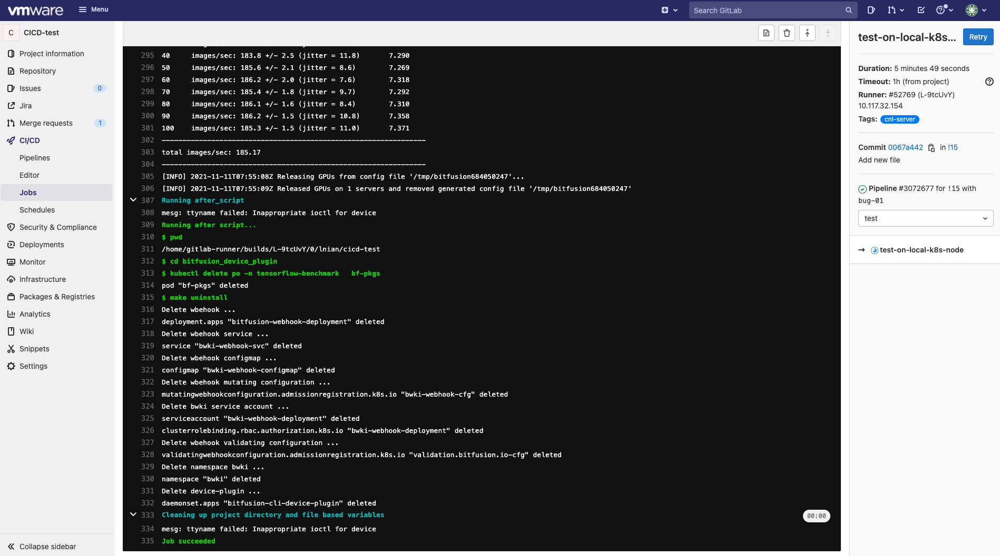
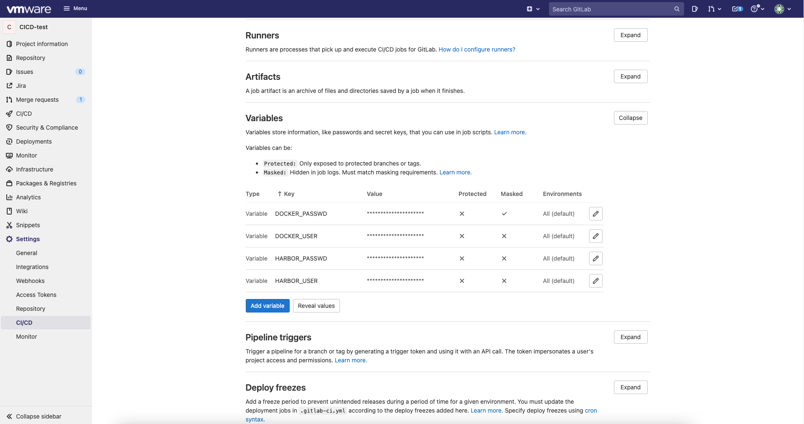

# CI/CD for Phaedo
CI-CD for Phaedo is a sub-tool for Phaedo project, when any merge request is post to the main branch，GitLab will automatically check and test the functionality of the code according to the pipline designed in `.gitlab-ci.yml`, which are:
* Checking whether there are syntax errors in the code, and whether the Dockerfiles of both webhook and device-plugin can be successfully compiled, generating target images.
* Deploying the built images to the kubernetes work node for testing, creating a pod that uses GPU resources to verify whether webhook and device-plugin can provide valid services.
Meanwhile, you can also use this tool to publish all images to several image registry by manually run a pipline through GitHub UI.


## 1. Quick start
### 1.1. Continuous Integration(CI)
By using CI/CD for Phaedo, whenever a merge request is post to main branch, the GitLab will automatically run a pipline, which is pre-defined in `.gitlab-ci.yml`，checking the code and test the functionality.

The below figure indicates the main branch has received a request to merge from the `bug-01` branch, you can view this information by entering in `Merge requests` tabs on the left sidebar. In this figure, GitLab is automatically executing a pipline and the status icon indicates the running status of each stage. 


The pipline runs two stages and each stage contains one job.The `build-deviceplugin-and-webhook` job belongs to the stage of `build-images`, it is responsible for constructing the corresponding images, tagged `alpha`, through the respective Dockerfiles of webhook and device-plugin, and then pushing them into the Harbor repository. If there are any syntax errors in the code or any potential problems that will cause compilation failure, the whole pipline will turn to failure. After the images are successfully built, their functionality will be verified in the test stage.

The `test-on-local-k8s-node` job belongs to the `test` stage. The newly built alpha images will be pulled from the Harbor registry, deploying them to the kubernetes cluster, and then a pod will be created, running a GPUs consumption program. If it runs successfully, proving that the images built from the code are effective. Otherwise, it will prove that there are functional defects in the code that fails the test.

You can check the execution log of each job by clicking on each stage status icon, the following figure shows the log of `test-on-local-k8s-node` job in the `test` stage.


If there is no error occured in pipline, the request reviewer can decide whether to approve a request or not, based on the feedback from CI result. Showing in the below figure.


### 1.2. Auto publish bitfusion device-plugin and bitfusion webhook images 
CI/CD for Phaedo also offer a more efficient way to pulish publish bitfusion device-plugin and bitfusion webhook images to specific registry, while for bitfusion-client image, please refer to another tool within this project <https://gitlab.eng.vmware.com/phaedo/bitfusion-device-plugin/-/tree/master/bitfusion_device_plugin/phaedopkgtool>

Clicking `CI/CD` on the left sidebar and select `Piplines`, then click `Run pipline` button at top-right corner


Then please add a variable named **imagetag**, and input its value,l which indicates the tag version of bitfusion device-plugin and bitfusion webhook images that you'd like to publish.


You will get a new pipline in `Piplines` page.


If both `Build-images` and `Test` stage are succussfully passed, you can click the play icon of `Pulish` stage to pulish you images, showing in the following figure.


After all these, bitfusion device-plugin and bitfusion webhook images will be pushed into several target registries, they can are specified in `gitlab-ci.yml`. For an example, below scipts indicates the images will be published to `ccr.ccs.tencentyun.com` registry, you may need to use hidden variables to store the registry user information, see section [2.4. Create project variables used in gitlab-ci.yml for the project](#24-create-project-variables-used-in-gitlab-ciyml-for-the-project) for more details.
```
    - docker tag $TestRegistry/bitfusiondeviceplugin/bitfusion-device-plugin:$TestImageTag ccr.ccs.tencentyun.com/bitfusiondeviceplugin/bitfusion-device-plugin:$imagetag
    - docker tag $TestRegistry/bitfusiondeviceplugin/bitfusion-webhook:$TestImageTag $TestRegistry/bitfusiondeviceplugin/bitfusion-webhook:$imagetag
    - echo "$CCR_PASSWD" | docker login ccr.ccs.tencentyun.com -u "$CCR_USER" --password-stdin
    - docker push ccr.ccs.tencentyun.com/bitfusiondeviceplugin/bitfusion-device-plugin:$imagetag
    - docker push ccr.ccs.tencentyun.com/bitfusiondeviceplugin/bitfusion-webhook:$imagetag
```
## 2. Set up your own CI/CD for Phaedo tool
### 2.1. prerequisite
This tool relies on the CI/CD service and interface provided by the GitLab platform, the entire pipline structure are designed in `.gitlab-ci.yml`. At the same time, the machine for building and deploying the images should be prepared in advance, and registered as a `runner` that can be recognized by GitLab. The jobs defined in `.gitlab-ci.yml` will be executed on one or more `runners`. In this project, the images-build and deployment are executed on different runners, of course, you can also use one runner to complete all the job. If you need to build a custom CI/CD tool for your own Phaedo project, you need:
* GitLab
* A machine with docker, to compile and build webhook and device-plugin images.
* A machine with Kubernetes 1.17, to deploy the built image and test the effectiveness of their services.
* A private or a public image registry, to store images tagged `alpha` built in the CI/CD process
### 2.2. Register runners for you project
Enter the project in GitLab, find the `CI/CD` button in the `Setting` item and click it.

Expand the `Runner` tab of the page, copy the URL and token required for registration, click the `Show Runner installation instructions` button, and follow the steps to register your machine as a runner that can be identified by GitLab. When registering a runner, you need to input the `tags` attribute, this field is equivalent to the identity of the runner.


If the job need to be executed by a specific linux user, you should modify the `/etc/systemd/system/gitlab-runner.service` file and edit the `ExecStart` field, where change the `--user` attribute from `gitlab-runner` to your desired user.

### 2.3. Edit gitlab-ci.yml to define your pipline
In your project, click on the `CI/CD` tabs on the left bar, find the `Editor` button and enter, editing the `gitlab-ci.yml` file.


Use the previous `gitlab-ci.yml` file as an example, which define two stages: `build-images` and `test`, and its structure can be summarized as follows:
```
pipline:
    - stages: build-images
        - job: build-deviceplugin-and-webhook
            - only: merge_requests
            - tags: nimbus

    - stages: test
        - job: test-on-local-k8s-node
            - only: merge_requests
            - tags: cnl-server        
```


`build-images` includes job `build-deviceplugin-and-webhook`, which is used to compile and build device-plugin and webhook images. This job will be executed on the runner whose tags are `nimbus`. `test` includes a job named `test-on-local-k8s-node`, which is used to pull the built image and deploy it, and then start a pod using GPU to test whether the pod can be completed correctly. This job will be Execute on the runner whose tags are `cnl-server`. Please change the tags attribute in each job to the runner tags registered yourself. The attribute `only: merge_requests` indicates that these two jobs will only be triggered to execute when the `main` branch receives a merge request.

For more information and custom function implementation, please refer to the GitLab CI/CD document: <https://gitlab.eng.vmware.com/help/ci/yaml/index.md>

In `gitlab-ci.yml`, two public environment variables of `TestRegistry` and `ImageTag` are used, which indicates the address of the Harbor registry used and the image tag issued during the CI/CD, which can be modified according to your own needs.

### 2.4. Create project variables used in gitlab-ci.yml for the project
In the job defined in this `gitlab-ci.yml`, it involves using the docker command to login to Docker and login to the Harbor mirror repository. For security reasons, all login information (username, password) has been stored in GitLab in the form of variables. Find the `CI/CD` button from the left bar item `Setting` and click, then find the `Variables` label and expand it.


Click `Add variable` to create a variable, where `Key` is the name of the variable, and `Value` represents the value of this variable. For password-type variables, it is recommended to check `Mask variable` checkbox.


### 2.5. All set
For now, your project already has the CI/CD tool. When a action trigger the CI/CD rules defined in `.gitlab-ci.yml`, GitLab will perform your jobs.


